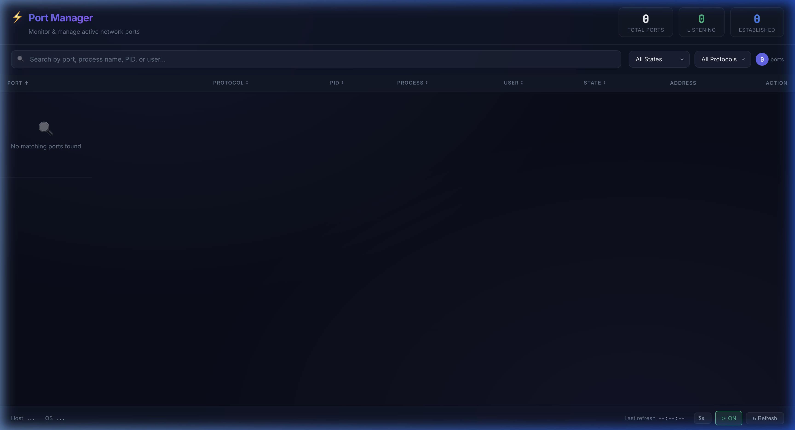

# ⚡ Port Manager

A fast and lightweight desktop application for monitoring and managing active network ports on macOS, built with **Tauri v2 + React + TypeScript**.



---

## ✨ Features

| Feature                  | Description                                                                |
| ------------------------ | -------------------------------------------------------------------------- |
| 📊 **Port Listing**      | แสดง port ที่ active ทั้งหมด พร้อม PID, Process Name, User, State, Address |
| 🔪 **Kill Process**      | Kill process ได้ทันทีพร้อม confirmation dialog ป้องกันการกดพลาด            |
| 🔍 **Search & Filter**   | ค้นหาตาม port number, process name, PID, user                              |
| 🏷️ **State Filter**      | กรองตาม state: LISTEN, ESTABLISHED, CLOSE_WAIT, TIME_WAIT                  |
| 📡 **Protocol Filter**   | กรองตาม protocol: TCP, UDP                                                 |
| 📋 **Copy to Clipboard** | คลิก port หรือ PID เพื่อ copy ได้ทันที                                     |
| 🔄 **Auto Refresh**      | อัปเดตข้อมูลอัตโนมัติ (1s / 3s / 5s / 10s)                                 |
| 📊 **Sort**              | Sort ตาม column ได้ทุก column                                              |
| 🖥️ **System Info**       | แสดง Hostname, OS Version                                                  |
| 🌙 **Dark Theme**        | UI สวยด้วย glassmorphism + gradient                                        |

---

## 🛠️ Tech Stack

| Technology                                    | Role                                   |
| --------------------------------------------- | -------------------------------------- |
| [Tauri v2](https://v2.tauri.app/)             | Desktop app framework                  |
| [Rust](https://www.rust-lang.org/)            | Backend - system commands (lsof, kill) |
| [React 18](https://react.dev/)                | Frontend UI library                    |
| [TypeScript](https://www.typescriptlang.org/) | Type-safe JavaScript                   |
| [Vite](https://vitejs.dev/)                   | Frontend bundler                       |
| Vanilla CSS                                   | Styling (dark glassmorphism theme)     |

---

## 📦 Installation

### Prerequisites

| Tool                | Version | Install                                                           |
| ------------------- | ------- | ----------------------------------------------------------------- |
| **Node.js**         | >= 18.x | [nodejs.org](https://nodejs.org/)                                 |
| **Rust**            | >= 1.70 | `curl --proto '=https' --tlsv1.2 -sSf https://sh.rustup.rs \| sh` |
| **Xcode CLI Tools** | Latest  | `xcode-select --install`                                          |

### Setup

```bash
# 1. Clone the repository
git clone https://github.com/Nakarin1997/port-manager.git
cd port-manager

# 2. Install dependencies
npm install

# 3. Run in development mode
npm run tauri dev
```

> ⚠️ **Note**: การ build ครั้งแรกจะใช้เวลาประมาณ 45-60 วินาที เพราะ Rust ต้อง compile dependencies ทั้งหมด ครั้งถัดๆ ไปจะเร็วมาก (~2-3 วินาที)

---

## 🚀 Running the App

App นี้สามารถรันได้ **3 แบบ**:

### แบบที่ 1: 🖥️ Desktop App (แนะนำ)

เปิดเป็น **native desktop window** — ใช้ได้ครบทุกฟีเจอร์ (ดู port, kill process, system info)

```bash
# Development mode (hot-reload)
npm run tauri dev

# Build เป็นไฟล์ .app / .dmg สำหรับแจกจ่าย
npm run tauri build
```

| Item            | Detail                                                   |
| --------------- | -------------------------------------------------------- |
| **ต้องติดตั้ง** | Node.js + Rust                                           |
| **ไฟล์ที่ได้**  | `src-tauri/target/release/bundle/macos/Port Manager.app` |
| **ฟีเจอร์**     | ✅ ครบทุกอย่าง (port listing, kill, system info)         |

> ⚠️ **Note**: Build ครั้งแรกใช้เวลา ~45-60 วินาที (Rust compile dependencies) ครั้งถัดไปเร็วมาก (~2-3 วินาที)

---

### แบบที่ 2: 🌐 Web Browser (Dev Server)

เปิดบน **browser** ที่ `http://localhost:1420` — ดู UI ได้ แต่ **ไม่สามารถ** ดู port หรือ kill process ได้ (เพราะ browser ไม่มี Rust backend)

```bash
# รันเฉพาะ frontend (Vite dev server)
npm run dev
```

| Item            | Detail                                |
| --------------- | ------------------------------------- |
| **ต้องติดตั้ง** | Node.js เท่านั้น                      |
| **เปิดที่**     | `http://localhost:1420`               |
| **ฟีเจอร์**     | ⚠️ ดูได้เฉพาะ UI (ไม่มี Rust backend) |

---

### แบบที่ 3: 🐳 Docker (Web Server)

Build frontend แล้ว serve ผ่าน **Nginx** บน Docker — เหมาะสำหรับ CI/CD, preview, หรือแชร์ UI ให้คนอื่นดู

```bash
# Build & Run ด้วย Docker Compose
docker compose up -d

# หรือ Build ด้วย Docker ตรงๆ
docker build -t port-manager .
docker run -d -p 3080:80 port-manager
```

| Item            | Detail                                |
| --------------- | ------------------------------------- |
| **ต้องติดตั้ง** | Docker เท่านั้น                       |
| **เปิดที่**     | `http://localhost:3080`               |
| **ฟีเจอร์**     | ⚠️ ดูได้เฉพาะ UI (ไม่มี Rust backend) |

---

### 📊 สรุปเปรียบเทียบ

|                  | 🖥️ Desktop App      | 🌐 Web (Dev)  | 🐳 Docker           |
| ---------------- | ------------------- | ------------- | ------------------- |
| **คำสั่ง**       | `npm run tauri dev` | `npm run dev` | `docker compose up` |
| **ต้องลง Rust**  | ✅ ใช่              | ❌ ไม่ต้อง    | ❌ ไม่ต้อง          |
| **ดู Port**      | ✅ ได้              | ❌ ไม่ได้     | ❌ ไม่ได้           |
| **Kill Process** | ✅ ได้              | ❌ ไม่ได้     | ❌ ไม่ได้           |
| **System Info**  | ✅ ได้              | ❌ ไม่ได้     | ❌ ไม่ได้           |
| **เหมาะกับ**     | ใช้งานจริง          | พัฒนา UI      | CI/CD, Preview      |

---

## 📁 Project Structure

```
port-manager/
├── src/                        # Frontend (React + TypeScript)
│   ├── App.tsx                 # Main app component
│   ├── App.css                 # Dark glassmorphism theme
│   ├── types.ts                # TypeScript interfaces
│   └── components/
│       ├── PortTable.tsx       # Port table with sort & copy
│       ├── SearchBar.tsx       # Search + filters
│       ├── KillDialog.tsx      # Kill confirmation dialog
│       └── StatusBar.tsx       # System info + refresh controls
├── src-tauri/                  # Backend (Rust)
│   ├── src/
│   │   ├── lib.rs              # Tauri commands (get_ports, kill, system_info)
│   │   └── main.rs             # Entry point
│   ├── Cargo.toml              # Rust dependencies
│   └── tauri.conf.json         # Tauri configuration
├── index.html                  # HTML entry point
├── package.json                # Node.js dependencies
├── Dockerfile                  # Docker build
├── docker-compose.yml          # Docker Compose config
├── vite.config.ts              # Vite configuration
└── README.md
```

---

## 🔧 How It Works

```
┌──────────────────────────────────────────┐
│            Desktop App (Tauri)           │
│                                          │
│  ┌────────────────────────────────────┐  │
│  │  Frontend (React + TypeScript)     │  │
│  │  • Port Table, Search, Kill Dialog │  │
│  └──────────────┬─────────────────────┘  │
│                 │ invoke()               │
│  ┌──────────────▼─────────────────────┐  │
│  │  Backend (Rust)                    │  │
│  │  • /usr/sbin/lsof → parse ports    │  │
│  │  • /bin/kill → terminate process   │  │
│  │  • /bin/hostname → system info     │  │
│  └────────────────────────────────────┘  │
│                                          │
│  ┌────────────────────────────────────┐  │
│  │  macOS WebView (WebKit)            │  │
│  │  • No Chromium bundled!            │  │
│  └────────────────────────────────────┘  │
└──────────────────────────────────────────┘
```

---

## 📋 Available Commands

| Rust Command       | Description                                                               |
| ------------------ | ------------------------------------------------------------------------- |
| `get_active_ports` | ดึง port ทั้งหมดที่ active ผ่าน `lsof -iTCP -P -n` และ `lsof -iUDP -P -n` |
| `kill_process`     | Kill process ตาม PID (ลอง SIGTERM ก่อน ถ้าไม่ได้ใช้ SIGKILL)              |
| `get_system_info`  | ดึงข้อมูล hostname และ OS version                                         |

---

## 🔮 Future Features (Roadmap)

- [ ] 🪟 **Cross-platform** — รองรับ Windows และ Linux
- [ ] 📌 **Pin/Favorite Ports** — ปักหมุด port ที่สนใจไว้ด้านบน
- [ ] 📈 **Network Traffic Monitor** — แสดงปริมาณ traffic ของแต่ละ port
- [ ] 🔔 **Port Alerts** — แจ้งเตือนเมื่อมี port ใหม่เปิด หรือ port ที่ monitor หายไป
- [ ] 📊 **Charts & Analytics** — กราฟแสดง port usage ตามช่วงเวลา
- [ ] 🏷️ **Process Grouping** — จัดกลุ่ม port ตาม application
- [ ] 💾 **Export** — Export ข้อมูล port เป็น CSV / JSON
- [ ] 🔐 **Whitelist/Blacklist** — กำหนด port ที่อนุญาต/ไม่อนุญาต
- [ ] 🎨 **Theme Customization** — เลือกธีมสีได้ (Light/Dark/Custom)
- [ ] 🌐 **Remote Monitor** — Monitor port ของเครื่องอื่นผ่าน SSH
- [ ] ⌨️ **Keyboard Shortcuts** — ปุ่มลัดสำหรับ refresh, search, kill
- [ ] 🧩 **System Tray** — ย่อลง system tray พร้อมแจ้งเตือน

---

## 👤 Author

**Nakarin1997**

- GitHub: [@Nakarin1997](https://github.com/Nakarin1997)

---

## 📄 License

This project is open source and available under the [MIT License](LICENSE).
